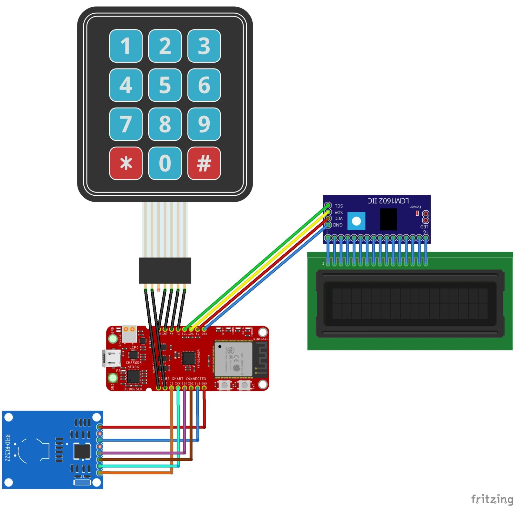
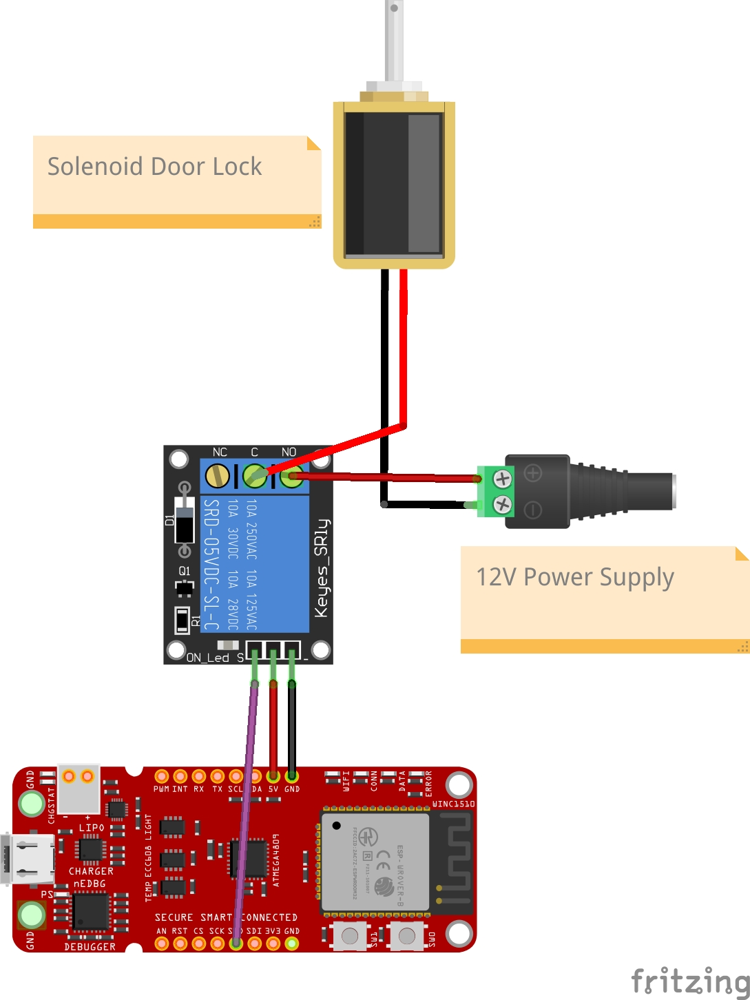

# Two-Factor Authenticated Door Lock

This project demonstrates a two-factor-authenticated door lock system. The system enhances physical security by requiring both an RFID card and a PIN code. It integrates embedded programming, low-level communication protocols, and secure inter-board messaging using microcontrollers.

---

## Features
- Two-factor authentication combining RFID and passcode input.
- Modular system split into a **Reader Board** and a **Controller Board**.
- Bluetooth communication between boards.
- Visual feedback via an LCD display.
- Security measures to prevent hotwiring and message forgery.

---

## Hardware Components
- **Reader Board:**
  - AVR-BLE microcontroller
  - ATECC508A cryptography chip
  - 12-button keypad
  - 16x2 character LCD module
  - MFRC522 RFID reader
  - Three RFID cards (13.56 MHz)
- **Controller Board:**
  - AVR-BLE microcontroller
  - ATECC508A cryptography chip
  - 5V single-channel relay module
  - 12V solenoid door lock
  - AC to DC adapter (120V 60Hz to 12V)

---

## System Overview

### Reader Board
- Captures user credentials via RFID and keypad.
- Displays prompts and results on the LCD.
- Sends concatenated credentials to the Controller Board for validation.

### Controller Board
- Validates credentials received from the Reader Board.
- Operates the door lock mechanism upon successful authentication.

### Communication
- **Bluetooth**: Secure wireless data exchange between the two boards.
- **SPI/I2C**: Handles communication with peripherals (RFID, LCD).

---

## Circuit Diagrams

### Reader Board

### Controller Board

---

## Usage
1. Scan your RFID card as prompted on the LCD.
2. Enter your 4-digit PIN on the keypad.
3. Submit credentials by pressing `#`.
4. The lock will open for 5 seconds if the credentials are valid.

### Additional Features
- `*` key allows users to delete inputs or rescan their RFID card.
- Unauthorized attempts are notified via the LCD.

---

## Limitations and Future Improvements
- Digital signature security via ATECC508A is incomplete due to hardware constraints.
- Limited keypad functionality due to insufficient GPIO pins.
- Potential improvements:
  - Store credentials in flash memory.
  - Admin mode for credential management.
  - GPIO extender for full keypad integration.

---

## Credits
Developed by Vinh Nguyen and Ryan Hill as part of the CSCI 5143 course final project.
